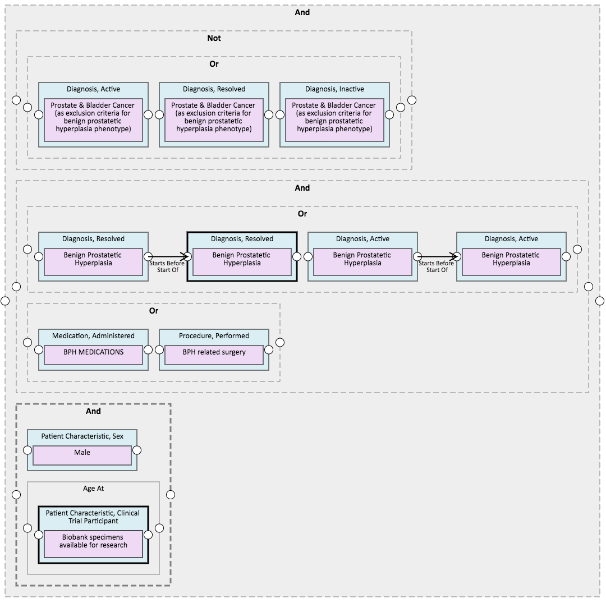

# PhEMA BPH Phenotype
Artifacts for the eMERGE benign prostatic hyperplasia (BPH) phenotype implemented in PhEMA [http://projectphema.org](http://projectphema.org)

The following artifacts are provided:

* phema-bph-use-case.xml - The HQMF representation of the BPH phenotype, as implemented in the PhEMA Authoring Tool
* PhEMA-KNIME-BPH-ValueSets.csv - an export of the value set definitions used by the phenotype.  The OIDs used to identify the value sets will match those in the HQMF definition.
* bph-v3.4.zip - the manually adjusted version of the i2b2-based KNIME template.  This was manually modified at each implementing institution with local i2b2 configuration information, and in some cases changes to account for local i2b2 ontology conventions.

